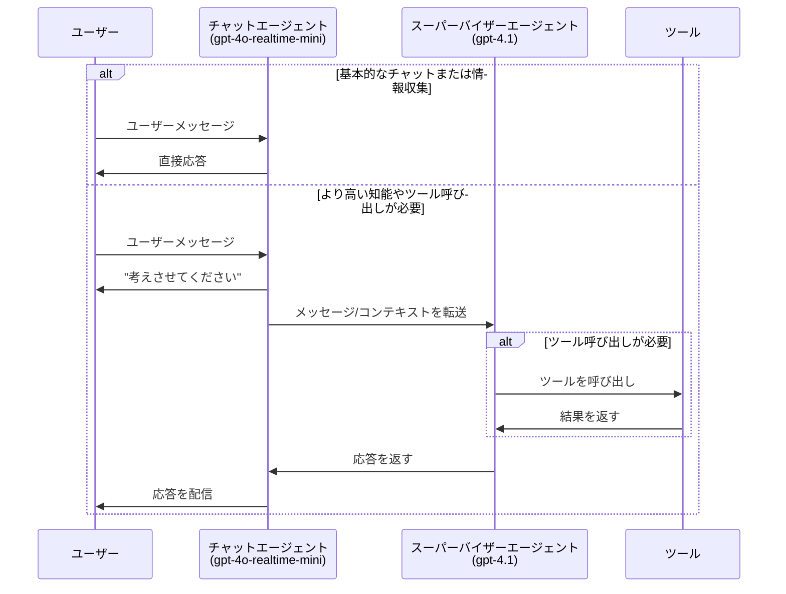
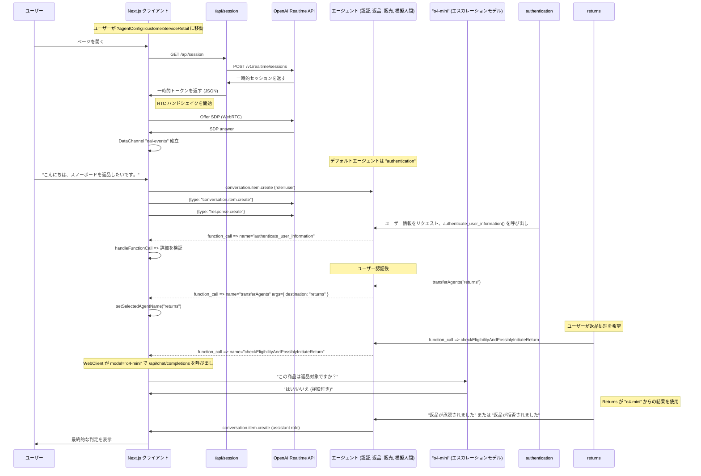

# リアルタイム API エージェント デモ

OpenAI Realtime API と OpenAI Agents SDK を使用した音声エージェントの高度なパターンを実演するデモアプリケーションです。

## OpenAI Agents SDK について

このプロジェクトでは [OpenAI Agents SDK](https://github.com/openai/openai-agents-js) を使用しています。これは高度な AI エージェントの構築、管理、デプロイメントのためのツールキットです。SDK は以下の機能を提供します：

- エージェントの動作とツール統合を定義するための統一インターフェース
- エージェントオーケストレーション、状態管理、イベント処理の組み込みサポート
- 低遅延ストリーミング対話のための OpenAI Realtime API との簡単な統合
- マルチエージェント協調、ハンドオフ、ツール使用、ガードレールの拡張可能なパターン

完全なドキュメント、ガイド、API リファレンスについては、公式の [OpenAI Agents SDK ドキュメント](https://github.com/openai/openai-agents-js#readme) をご覧ください。

**注意:** OpenAI Agents SDK を使用しないバージョンについては、[without-agents-sdk ブランチ](https://github.com/openai/openai-realtime-agents/tree/without-agents-sdk) をご覧ください。

このデモでは2つの主要なパターンを実演しています：
1. **チャット-スーパーバイザー:** リアルタイムベースのチャットエージェントがユーザーと対話し基本的なタスクを処理する一方で、より高度なテキストベースのスーパーバイザーモデル（例：`gpt-4.1`）がツール呼び出しやより複雑な応答に使用されます。このアプローチは簡単な導入と高品質な回答を提供し、遅延の増加は僅かです。
2. **順次ハンドオフ:** 特化されたエージェント（リアルタイム API によって駆動）が特定のユーザーの意図を処理するために、ユーザーを相互に転送します。これは、特定のドメインに特化したモデルがユーザーの意図を順次処理できるカスタマーサービスに最適です。これにより、単一のエージェントにすべての指示とツールを持たせることによるパフォーマンス低下を回避できます。

## セットアップ

- これは Next.js TypeScript アプリです。`npm i` で依存関係をインストールしてください。
- 環境変数に `OPENAI_API_KEY` を追加してください。`.bash_profile` または同等のファイルに追加するか、`.env.sample` を `.env` にコピーして追加してください。
- `npm run dev` でサーバーを起動してください
- ブラウザで [http://localhost:3000](http://localhost:3000) を開いてください。デフォルトで `chatSupervisor` エージェント設定になります。
- 右上の「Scenario」ドロップダウンから例を変更できます。

# エージェントパターン 1: チャット-スーパーバイザー

このパターンは [chatSupervisor](src/app/agentConfigs/chatSupervisor/index.ts) エージェント設定で実演されています。チャットエージェントはリアルタイムモデルを使用してユーザーと会話し、ユーザーへの挨拶、日常会話、情報収集などの基本的なタスクを処理します。一方で、より高度なテキストベースのスーパーバイザーモデル（例：`gpt-4.1`）がツール呼び出しやより困難な応答を広範囲に処理します。特定のタスクをチャットエージェントに「オプトイン」することで、決定境界を制御できます。

動画解説: [https://x.com/noahmacca/status/1927014156152058075](https://x.com/noahmacca/status/1927014156152058075)

## 例

*この会話では、電話番号を収集するための即座の応答と、ツール呼び出しを処理し応答を策定するためのスーパーバイザーエージェントへの委任に注目してください。「少々お待ちください」の発話が終了してから「お待たせしました。最後の請求書は...」の開始まで約2秒です。*

## 概要図


## メリット
- **簡単な導入**: すでに高性能なテキストベースのチャットエージェントがある場合、同じプロンプトとツールセットをスーパーバイザーエージェントに与え、チャットエージェントのプロンプトを少し調整するだけで、テキストエージェントと同等の性能を持つ自然な音声エージェントを作成できます。
- **完全なリアルタイムエージェントへの段階的移行**: エージェント全体をリアルタイム API に切り替えるのではなく、一度に一つのタスクずつ移行し、本番環境にデプロイする前に各タスクを検証し信頼を構築する時間を取ることができます。
- **高い知性**: 音声エージェントで `gpt-4.1` などのモデルの高い知性、優れたツール呼び出し、指示遵守の恩恵を受けることができます。
- **低コスト**: チャットエージェントが基本的なタスクにのみ使用される場合、realtime-mini モデルを使用でき、GPT-4.1 と組み合わせても、完全な 4o-realtime モデルを使用するよりも安価になるはずです。
- **ユーザーエクスペリエンス**: ユーザーが話し終えた後の応答遅延が1.5秒以上になることが多い継ぎ接ぎモデルアーキテクチャを使用するよりも、より自然な会話体験を提供します。このアーキテクチャでは、スーパーバイザーエージェントに依存する必要があってもモデルがすぐにユーザーに応答します。
  - ただし、完全な応答ですぐに応答するのではなく、「考えさせてください」から始まるアシスタント応答が多くなります。

## 独自エージェントの作成方法
1. [supervisorAgent](src/app/agentConfigs/chatSupervisorDemo/supervisorAgent.ts) を更新します。
  - 既存のテキストエージェントのプロンプトとツールがある場合は追加してください。これには音声エージェントロジックの「核心部分」を含め、何をすべき/すべきでないか、どのように正確に応答すべきかを非常に具体的にする必要があります。`==== Domain-Specific Agent Instructions ====` の下にこの情報を追加してください。
  - 音声により適したプロンプトに更新する必要があります。例えば、簡潔にすることや長いアイテムリストを避けることなどです。
2. [chatAgent](src/app/agentConfigs/chatSupervisor/index.ts) を更新します。
  - chatAgent の指示を独自のトーン、挨拶などでカスタマイズしてください。
  - `chatAgentInstructions` にツール定義を追加してください。モデルが混乱してツールを直接呼び出そうとしないよう、JSON ではなく簡潔な YAML 記述を推奨します。
  - `# Allow List of Permitted Actions` セクションに新しい項目を追加することで、決定境界を変更できます。
3. コストを削減するには、chatAgent に `gpt-4o-mini-realtime` を、スーパーバイザーモデルに `gpt-4.1-mini` を使用してみてください。特に困難またはハイステークなタスクで知性を最大化するには、遅延とのトレードオフを考慮し、スーパーバイザープロンプトに思考連鎖を追加するか、`o4-mini` を使用する追加の推論モデルベースのスーパーバイザーを使用することを検討してください。

# エージェントパターン 2: 順次ハンドオフ

このパターンは [OpenAI Swarm](https://github.com/openai/swarm) にインスパイアされており、特化されたエージェント間でのユーザーの順次ハンドオフを含みます。ハンドオフはモデルによって決定され、ツール呼び出しを通じて調整され、可能なハンドオフはエージェントグラフで明示的に定義されます。ハンドオフは新しい指示とツールで session.update イベントをトリガーします。このパターンは、それぞれが長い指示と多数のツールを持つ専門エージェントで様々なユーザーの意図を処理するのに効果的です。

動作方法を示す [動画解説](https://x.com/OpenAIDevs/status/1880306081517432936) があります。このリポジトリを使用して、20分未満で独自のマルチエージェントリアルタイム音声アプリのプロトタイプを作成できるはずです！


*この簡単な例では、ユーザーは greeter エージェントから haiku エージェントに転送されます。このフローの簡潔で完全な設定を以下に示します。*

`src/app/agentConfigs/simpleExample.ts` での設定
```typescript
import { RealtimeAgent } from '@openai/agents/realtime';

// OpenAI Agents SDK を使用してエージェントを定義
export const haikuWriterAgent = new RealtimeAgent({
  name: 'haikuWriter',
  handoffDescription: 'Agent that writes haikus.', // agent_transfer ツールのコンテキスト
  instructions:
    'Ask the user for a topic, then reply with a haiku about that topic.',
  tools: [],
  handoffs: [],
});

export const greeterAgent = new RealtimeAgent({
  name: 'greeter',
  handoffDescription: 'Agent that greets the user.',
  instructions:
    "Please greet the user and ask them if they'd like a haiku. If yes, hand off to the 'haikuWriter' agent.",
  tools: [],
  handoffs: [haikuWriterAgent], // このエージェントがハンドオフできるエージェントを定義
});

// エージェントセットは、シナリオに参加するエージェントの配列です
export default [greeterAgent, haikuWriterAgent];
```
## CustomerServiceRetail フロー

これは、以下の機能を持つカスタマーサービスフローを示すより複雑で代表的な実装です：
- ユーザー認証、返品、販売、エスカレーション用のプレースホルダー人間エージェントを含む、より複雑なエージェントグラフ
- 上記と同様のパターンを使用して、ハイステークな決定の例として返品を検証し開始するための [returns](https://github.com/openai/openai-realtime-agents/blob/60f4effc50a539b19b2f1fa4c38846086b58c295/src/app/agentConfigs/customerServiceRetail/returns.ts#L233) エージェントによる `o4-mini` へのエスカレーション
- ユーザーを認証するために名前や電話番号などを文字ごとに確認して正確に収集するなど、ステートマシンに従うようにモデルにプロンプトする
  - このフローをテストするには、スノーボードを返品したいと言って、必要なプロンプトを進めてください！

[src/app/agentConfigs/customerServiceRetail/index.ts](src/app/agentConfigs/customerServiceRetail/index.ts) での設定
```javascript
import authentication from "./authentication";
import returns from "./returns";
import sales from "./sales";
import simulatedHuman from "./simulatedHuman";
import { injectTransferTools } from "../utils";

authentication.downstreamAgents = [returns, sales, simulatedHuman];
returns.downstreamAgents = [authentication, sales, simulatedHuman];
sales.downstreamAgents = [authentication, returns, simulatedHuman];
simulatedHuman.downstreamAgents = [authentication, returns, sales];

const agents = injectTransferTools([
  authentication,
  returns,
  sales,
  simulatedHuman,
]);

export default agents;
```

## 概要図

この図は、詳細なイベントを含む `src/app/agentConfigs/customerServiceRetail/` で定義されたより高度な相互作用フローを示しています。

<details>
<summary><strong>CustomerServiceRetail フロー図を表示</strong></summary>



</details>

# その他の情報
## 次のステップ
- これらのテンプレートをコピーして独自のマルチエージェント音声アプリを作成できます！新しいエージェントセット設定を作成したら、`src/app/agentConfigs/index.ts` に追加することで、UI の「Scenario」ドロップダウンメニューで選択できるようになります。
- 各 agentConfig は instructions、tools、toolLogic を定義できます。デフォルトでは、すべてのツール呼び出しは単に `True` を返しますが、toolLogic を定義すると、特定のツールロジックを実行して会話にオブジェクトを返します（例：取得された RAG コンテキスト用）。
- ステートマシンの定義を含む customerServiceRetail で示されている規則を使用して独自のプロンプトを作成したい場合は、[こちら](src/app/agentConfigs/voiceAgentMetaprompt.txt) にメタプロンプトを含めているか、[Voice Agent Metaprompter GPT](https://chatgpt.com/g/g-678865c9fb5c81918fa28699735dd08e-voice-agent-metaprompt-gpt) を使用できます

## 出力ガードレール
アシスタントメッセージは UI に表示される前に安全性とコンプライアンスがチェックされます。ガードレールの呼び出しは現在 `src/app/App.tsx` 内に直接配置されています：`response.text.delta` ストリームが開始されると、メッセージを **IN_PROGRESS** としてマークし、サーバーが `guardrail_tripped` または `response.done` を発行すると、それぞれ **FAIL** または **PASS** としてマークします。モデレーションのトリガー方法や表示方法を変更したい場合は、`App.tsx` 内で `guardrail_tripped` を検索してロジックを調整してください。

## UI の操作方法
- Scenario ドロップダウンでエージェントシナリオを選択し、Agent ドロップダウンで特定のエージェントに自動的に切り替えることができます。
- 会話の記録は左側にあり、ツール呼び出し、ツール呼び出し応答、エージェント変更が含まれます。メッセージ以外の要素をクリックして展開できます。
- イベントログは右側にあり、クライアントとサーバーの両方のイベントを表示します。完全なペイロードを見るにはクリックしてください。
- 下部では、切断、自動音声活動検出または PTT の切り替え、音声再生のオフ、ログの切り替えができます。

## プルリクエスト

お気軽に issue やプルリクエストを開いてください。レビューに最善を尽くします。このリポジトリの精神は新しいエージェントフローのコアロジックを実演することです；このコアスコープを超える PR はマージされない可能性があります。

# コア貢献者
- Noah MacCallum - [noahmacca](https://x.com/noahmacca)
- Ilan Bigio - [ibigio](https://github.com/ibigio)
- Brian Fioca - [bfioca](https://github.com/bfioca)
